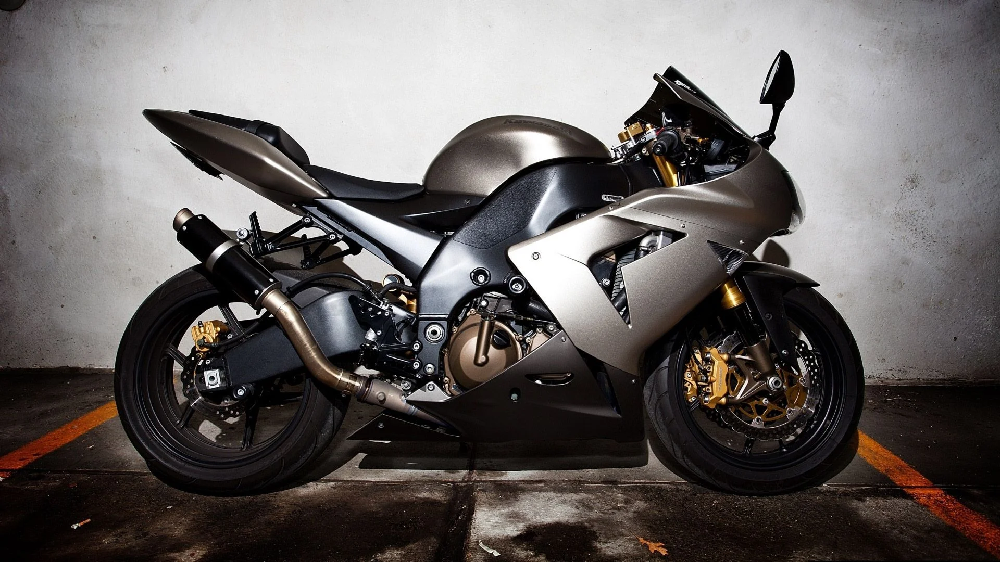
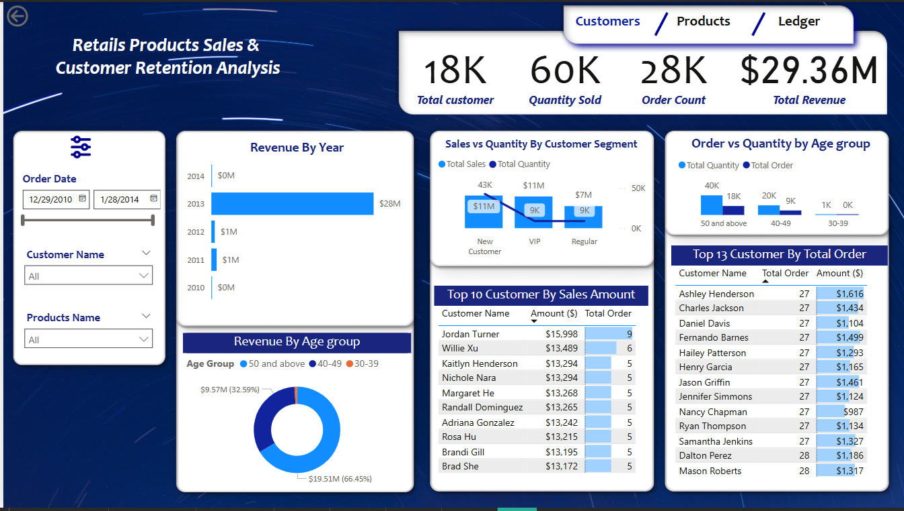
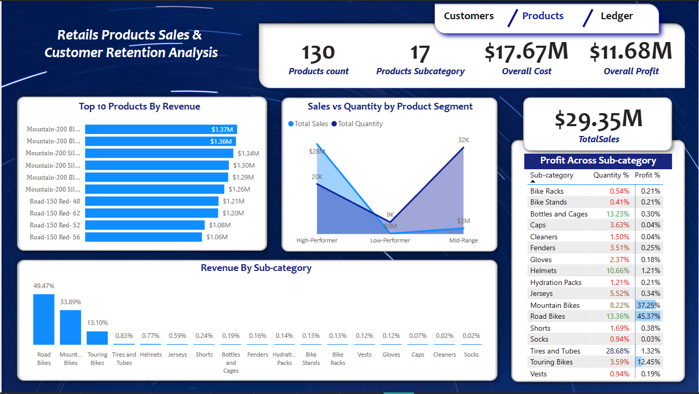
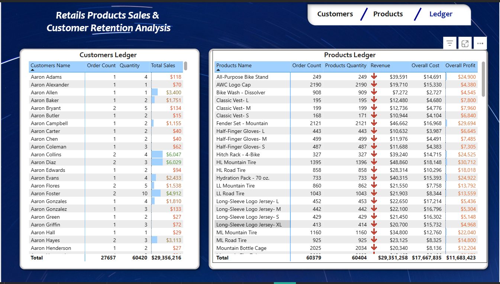

#  Products Sales & Customer Retention Analysis (Bike Store)

## Project Overview
This project involved developing an interactive Power BI dashboard designed to provide comprehensive insights into product sales performance and customer retention. The analysis aims to empower data-driven decision-making by highlighting key trends, identifying top-performing products and customer segments, and revealing opportunities for strategic improvements in sales and marketing efforts.

## Data Source
- The dataset for this analysis was curated from a Microsoft SQL database, ensuring data integrity and consistency. The SQL script used for data extraction and transformation (as previously documented in SQLQuery3.sql) leveraged advanced SQL techniques, including Window functions, Common Table Expressions (CTEs), and subqueries to prepare the data for robust analysis.
- The primary tables used in the dashboard are the customer and product report views created in this SQL project. The [dataset link is here.](https://github.com/Linconnaire/SQL-Advanced-Data-Analytics-Bike-Store-)
- Also, both customer and product tables' csv files are in the file section.

## Tools Used
- Microsoft SQL Server: For storage, management, and initial data preparation.

- Power BI: For data modelling, analysis, and interactive dashboard visualisation.

## Key Metrics Analysed:
- Total Customers: 18K

- Quantity Sold: 60K

- Total Revenue: $29.36M

- Order Count: 28K

- Products: 130 SKUs, 17 Subcategories

- Profit: $11.68M, Cost: $17.67M

## 👤 Customer Behaviour Insights:

- High Order Frequency: Most top customers placed between 27–28 orders, showing strong engagement.

- Age Group Impact: Customers aged 50 and above generated the highest number of orders (18K) and revenue share (66.45%).

- Segment Analysis: VIP customers and regular customers had equal purchase quantities (9K), but new customers had higher quantities sold compared to others.

### Actionable Insight:
- Older age groups and VIP segments are more valuable targets for loyalty campaigns and premium bundles for them.

## 🛒 Product Performance Insights:

### Top Performers:

- Mountain-200 and Road-150 bikes dominated revenue, each contributing over $1M+.

### Subcategory Revenue Share:

- Road Bikes (49.47%) and Mountain Bikes (33.89%) were the major revenue contributors.

### Profitability:

- Highest profit margins from Road Bikes (45.37%) and Mountain Bikes (37.25%).

- Low-Performers: Products like socks, vests, and gloves had minimal profit margins and high inventory counts.

### Actionable Insight:
- Focus marketing on high-profit subcategories, and consider bundling or phasing out low-performing SKUs.

## 💼 Customer & Product Ledger Overview:

- Granular visibility into each customer's order count, quantity purchased, and revenue generated.

- Product ledger tracks total units sold, revenue, cost, and profit per SKU.

## 📈 Recommendations:

### Retention Strategy:
    
- Introduce age-specific loyalty programs (especially for the 50+ age group).
- Expand personalised promotions for repeat customers with high order counts.

### Product Optimisation:

- Reallocate inventory investment from underperforming SKUs to high-margin products.
- Promote bundles for low-movement accessories to increase the attachment rate.

### Data-Driven Segmentation:

- Refine customer segmentation using RFM analysis for deeper targeting.
- Use order history to build predictive models for churn prevention.

## ✅ Conclusion:
This Power BI dashboard enables strategic decisions by providing a 360-degree view of retail performance, product viability, and customer value. By leveraging customer age and segment behaviour, and aligning product focus based on profitability, stakeholders can drive targeted growth and improved retention outcomes.
